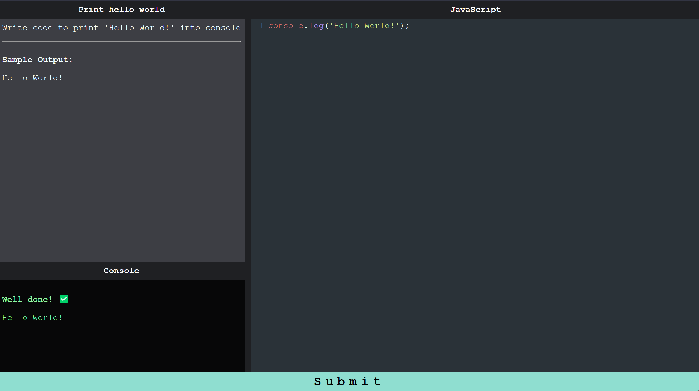

# Code Challenges 🤯 💣 💥

# Project

From zero to FullStack - an unofficial course led by [Pedro Soares](https://github.com/pncsoares) with the aim of guiding and helping two friends to learn programming and become software developers.

# Introduction

This repository aims to test what you studied so far and challenge you 💪



# Technologies

- [React](https://reactjs.org/docs/getting-started.html)
- [NPM](https://www.npmjs.com)
- [Prettier](https://prettier.io/docs/en/)

# Setup

## Run locally

Create and go to the directory where you want to place the repository

```bash
  cd my-directory
```

Clone the project

```bash
  git clone https://github.com/from-zero-to-fullstack/challenges.git
```

Go to the project directory

```bash
  cd challenges
```

Open in Visual Studio Code

```bash
  code .
```

# Run the app

## Install dependencies

Open terminal and run the following command:
```bash
  npm i
```

## Run

Execute the following command:
```bash
  npm start
```

A browser page will open automagically 🪄

# Code format

We use prettier in this repository and, after you write or change the source code, run the following command in the terminal:
```bash
  npx prettier --write .
```

# License

MIT